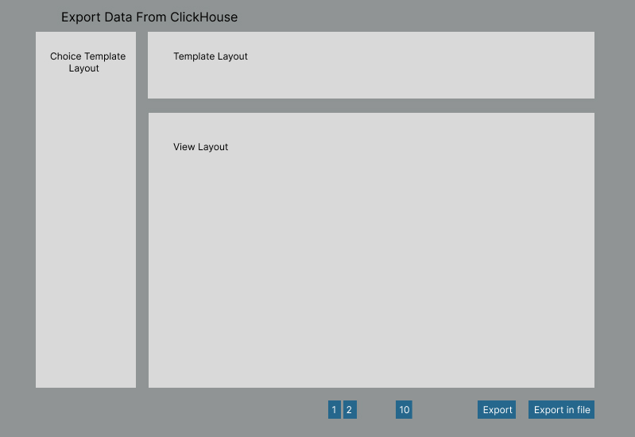

# API для экспорта данных из ClickHouse

Проект представляет собой удобное и эффективное API для экспорта данных из Clickhouse - мощной и масштабируемой системы 
управления данными. Наше API обеспечивает простой и надежный способ извлечения данных из Clickhouse для дальнейшей 
обработки, анализа или интеграции в другие приложения и сервисы. Независимо от ваших потребностей в области аналитики 
данных или разработки приложений, наше API обеспечит гибкую и эффективную интеграцию с Clickhouse, помогая вам 
максимально эффективно использовать данные вашей базы данных.

## Визуальное отображение фронтенда

## Описание MVP

MVP для проекта, предоставляющего API для экспорта данных из Clickhouse, включает в себя следующие ключевые функции:

1. **Аутентификация и авторизация:** Простая система аутентификации для доступа к API с использованием токенов.
2. **Экспорт данных:** Возможность указать таблицы и поля для экспорта данных из Clickhouse. API должно поддерживать 
различные форматы данных, такие как JSON или CSV.
3. **Фильтрация и сортировка:** Возможность применять фильтры и сортировку к данным перед экспортом, чтобы пользователь 
мог получать только необходимую информацию.
4. **Пагинация:** Поддержка пагинации результатов для работы с большими объемами данных и управления нагрузкой на сервер.
5. **Мониторинг и логирование:** Простой механизм для мониторинга активности API и логирования запросов и ошибок для 
отладки и анализа производительности.
6. **Документация API:** Понятная и полезная документация, объясняющая как использовать API, его эндпоинты, параметры 
запросов и примеры использования.
7. **Простой пример использования:** Предоставление примера кода или инструкций для быстрого начала работы с API.
8. **Тестирование:** Базовые тесты для проверки основной функциональности API и обеспечения его надежной работы.

MVP должен обеспечить базовый набор функций, достаточный для того, чтобы пользователи могли начать использовать API и 
оценить его ценность, при этом минимизируя затраты на разработку и время до запуска.

## Архитектура

## Документация

1. Маркетинг и аналитика
   1. [Целевая аудитория](docs/01-bisness/01-target-audience.md)
   2. [Заинтересанты](docs/01-bisness/02-stakeholders.md)
   3. [Пользовательские истории](docs/01-bisness/03-user-stories.md)
2. Требования:
   1. [Функциональные требования](./docs/02-analysis/01-functional-requiremens.md)
   2. [Нефункциональные требования](./docs/02-analysis/02-nonfunctional-requirements.md)
3. Сущности
   1. [Запрос](./docs/03-entities/01-query.md)
   2. [Ответ](./docs/03-entities/02-response.md)
4. DevOps
   1. [Файлы сборки](./deploy)
